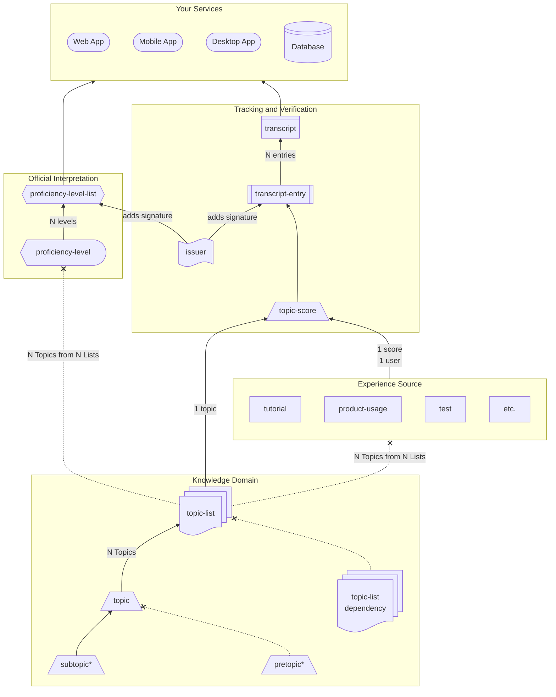

# Open Proficiency Model

The Open Proficiency Model (OPM) is an open definition for quantifying an individual's familiarity with skills, capabilities, and other abilities.

Definitions to define the knowledge space:

- [Topic](specs/topic.md) - a defined unique area of knowledge for gaining experience and becoming proficient.
- [Topic List](specs/topic-list.md) - A list of topics provided by an issuer.
- [Issuer](specs/issuer.md) - A verified entity that can provide a topic list and/or create transcript entries.

Definitions to define and store proficiency:

- [Experience Source](specs/experience-source.md) - activities a user can complete to increase proficiency in topics. (regular work, projects, tutorials, etc.)
- [Topic Score](specs/topic-score.md) - a label indicating the degree of understanding for a specific topic.
- [Transcript Entry](specs/transcript-entry.md) - a topic score assigned to a specific user, claimed by an issuer.
- [Transcript](specs/transcript.md) - a collection of transcript entries for easier portability.

Definitions to interpret proficiency:

- [Topic Score Interpretation](specs/score-interpretation.md) - a standardized interpretation for a set of topic scores.
- [Topic Score Interpretation List](specs/score-interpretation-list.md) - a collection of topic score interpretations. Examples:
  - [Badging](specs/score-interpretation-list.md#badges---goldsilverbronze)
  - [Skill Proficiency Levels](specs/score-interpretation-list.md#simple-progression---arithmetic)
  - [Job Role Levels](specs/score-interpretation-list.md#job-roles---math-teacher)

## Advantages

- **Verified** - All proficiency is signed by the issuer.
- **Distributed** - All transcript records are independent of the issuer and learning source.
- **Never Repeat** - Knowledge topics and proficiency are transferrable. New courses on the same topics don't invalidate old courses.

## Diagram

\* The `pre-` and `sub-` prefixes only indicate relationships between topics. They are not a different component.
