# Design

Below are diagram components to help clarify the relationship between topics, for describing relationships of a knowledge domain.

## Knowledge Space

### Topic

A trapezoidal "building block" represents a single **topic** in the knowledge domain.

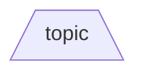
```mermaid
flowchart BT
  topic[/"topic"\]
```

### Subtopic

A solid line and arrow represents one **subtopic** in a **group topic**.

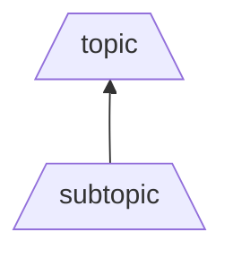
```mermaid
flowchart BT
  topic[/"topic"\]
  subtopic[/"subtopic"\] --> topic
```

### Pretopic

A dashed line and `x` represents a **pretopic** for another **topic**.

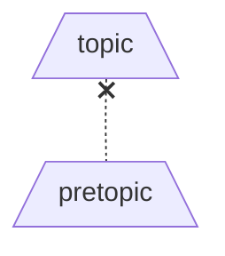
```mermaid
flowchart BT
  topic[/"topic"\]

  pretopic[/"pretopic"\] -.-x topic
```

### Topic List

A collection icon represents many topics combined together into a knowledge domain.

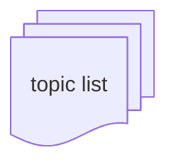
```mermaid
flowchart BT
  A@{ shape: docs, label: "topic list" }
```

## Storing Proficiency

### Topic score

Displaying a score below a topic name.

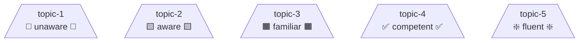
```mermaid
flowchart

t1[/"topic-1<br/>◻️ unaware ◻️"\]
t2[/"topic-2<br/>🟨 aware 🟨"\]
t3[/"topic-3<br/>🟧 familiar 🟧"\]
t4[/"topic-4<br/>✅ competent ✅ "\]
t5[/"topic-5<br/>❇️ fluent ❇️"\]
```

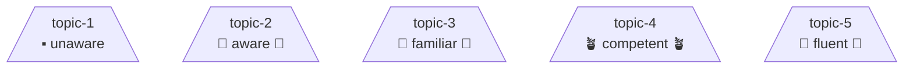
```mermaid
flowchart

t1[/"topic-1<br/>▪️ unaware"\]
t2[/"topic-2<br/>🌱 aware 🌱"\]
t3[/"topic-3<br/>🌿 familiar 🌿"\]
t4[/"topic-4<br/>🪴 competent 🪴"\]
t5[/"topic-5<br/>🌲 fluent 🌲"\]
```

### Transcript Entry

Adding an issuer to a topic score, indicates who is claiming it (a signature was added).

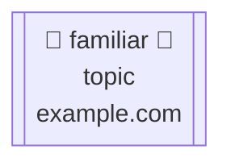
```mermaid
flowchart BT
  transcript-entry@{ shape: subproc, label: "🌿 familiar 🌿<br/>topic<br/>example.com" }
```

### Transcript

A **transcript** is shown as a user ID.

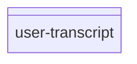
```mermaid
flowchart BT
  transcript@{ shape: div-rect, label: "user-transcript" }
```

---

Additional details about transcript entries that it contains.

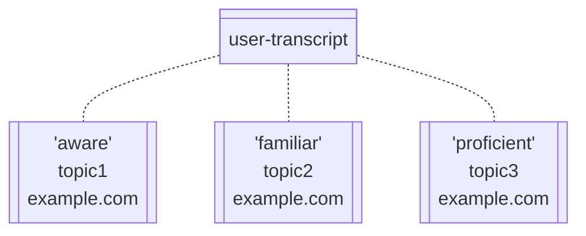
```mermaid
flowchart BT
  transcript@{ shape: div-rect, label: "user-transcript" }

  transcript-entry1@{ shape: subproc, label: "'aware'<br/>topic1<br/>example.com" }
  transcript-entry2@{ shape: subproc, label: "'familiar'<br/>topic2<br/>example.com" }
  transcript-entry3@{ shape: subproc, label: "'proficient'<br/>topic3<br/>example.com" }

  transcript-entry1 -.- transcript
  transcript-entry2 -.- transcript
  transcript-entry3 -.- transcript

```

### Issuer

An **issuer** is displayed as the owned domain name.

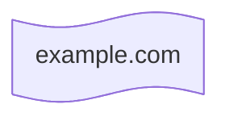
```mermaid
flowchart BT
  issuer@{ shape: flag, label: "example.com" }
```

## Proficiency Interpretation

### Score Interpretation

A **score interpretation** is displayed as a named target with required topic scores mapped to it.

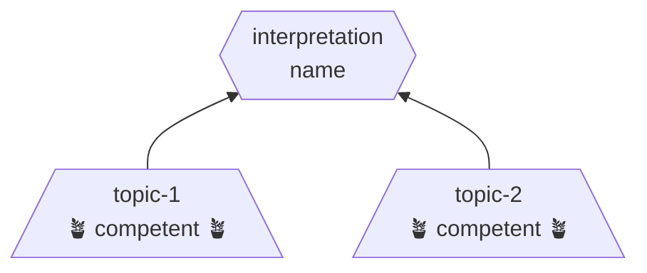
```mermaid
flowchart BT

%% Interpretation
score-interpretation{{"interpretation<br/>name"}}

%% Topic Scores
topic-1[/topic-1<br/>🪴 competent 🪴\]
topic-2[/topic-2<br/>🪴 competent 🪴\]

%% Mapping
topic-1 --> score-interpretation
topic-2 --> score-interpretation
```

### Score Interpretation List

A **score interpretation list** is displayed as a collection of interpretations with mapped topic-score requirements.

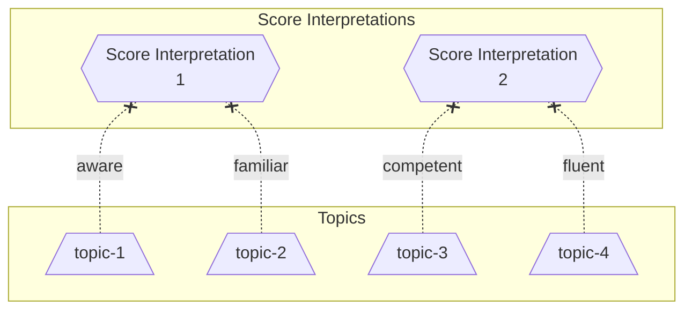
```mermaid
flowchart BT

subgraph Topics
  topic-1[/topic-1\]
  topic-2[/topic-2\]

  topic-3[/topic-3\]
  topic-4[/topic-4\]
end

subgraph Score Interpretations
  score-interpretation-1{{"Score Interpretation<br/>1"}}
  score-interpretation-2{{"Score Interpretation<br/>2"}}
end

%% Mapping
topic-1 -.aware.-x score-interpretation-1
topic-2 -.familiar.-x score-interpretation-1

topic-3 -.competent.-x score-interpretation-2
topic-4 -.fluent.-x score-interpretation-2
```
