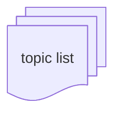

# Design

Below are diagram components to help clarify the relationship between topics, for describing relationships of a knowledge domain.

## Topics

### Topic

A trapazoidal "building block" represents a single **topic**.

### Subtopic

A solid line and arrow specifies one **subtopic** in a **group topic**.

### Pretopic

A dashed line and `x` specifies a **pretopic** for another **topic**.

### Proficiency Score

A **proficiency** score is shown as a number above the text of a **topic**.

### Topic List

