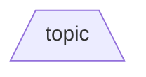
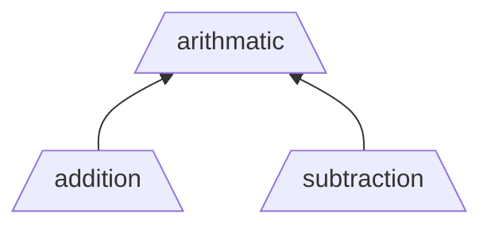
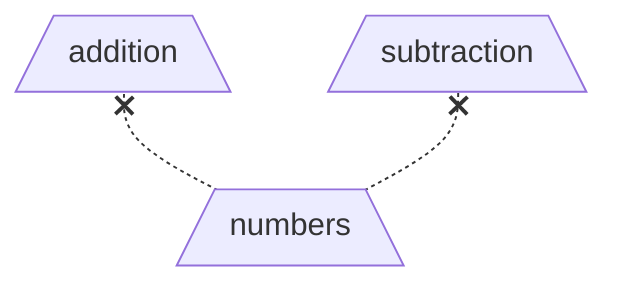
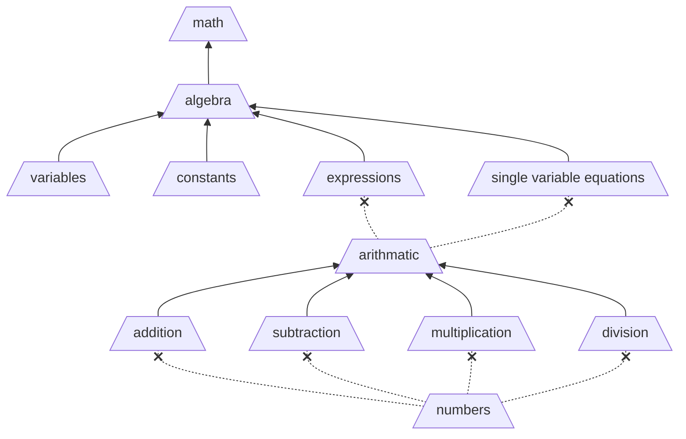

# Experience Topic

A **Topic** is a defined unique area of knowledge.

- Topics are the fundamental building blocks for defining relationships between different units of knowledge.
- A topic should as specific as possible to avoid overlapping knowledge domains. (i.e. specific, clear, unambiguous).
- All topics are equal, however they are referred as different types depending on their relationship to other topics.

### Proficiency

- A [user](user.md) may be assigned a [proficiency](experience-level.md) level for a particular topic.

## Types of Topics

An **Atomic Topic** is a topic that is self-declared as a smallest knowledge domain.

- **Good Examples**: `addition`, `subtraction`
- **Bad Examples** `math`, `arithmatic`

A **Group Topic** is a topic with defined subtopics.

- Each subtopic **directly** represent proficiency in a subspace of the group topic.
- Full proficiency in all subtopics indicates full proficiency in the group topic.
- Grouping topics provides an abstraction mechanism for organic growth of the knowledge domains without exhaustive early definitions, both higher (more general) and lower (more specific).

A **Subtopic** is a topic representing proficiency in a subspace of a **single** group topic.

- Topics **DO NOT** share subtopics.

A **Pretopic**, is a topic referenced as a prerequisite in order to **begin** building proficiency in the current topic.

- Proficiency in a pretopic does **NOT** indicate proficiency in the topic requiring it.
- Any topic can be a pretopic.
- A topic may be used as a pretopic by multiple other topics.

## Tips

- Use abstraction to clarify seemingly overlapping domains (i.e. same words but different context)

- A Group's dependencies should ideally be at a similar abstraction "layer of knowledge". This avoids a group topic with a very large number of subtopics.

- Group topics enable the knowledge space to expand. For example:

  - Grow Higher - Create a new topic by combining exsiting subtopics. This defines higher-order ability.
  - Refactor - Replace a set of subtopics with a new group topic defined by the same subtopics.
  - Go Deeper - Create new topics then add them to an existing atomic topic, converting it into a group topic.

## Detailed Example

Below is a simple example mapping the increasing proficiency from simple numbers to basic math proficiency.

> [!NOTE]
> The below is for illustration only. It is **_NOT_** intended to be an accurate representation.

### What does this graph say?

- The `addition` topic requires understanding the `numbers` topic before beginning.
- The `arithmatic` topic is understood if `addition`, `subtraction`, `multiplication`, and `division` are understood.
- The `expressions` topic requires understanding the `arithmatic` topic before beginning.
- The `algebra` topic is 50% understood if the `variables` and `constants` topics are understood, but not the `expressions` and `single variable equations` topics.
