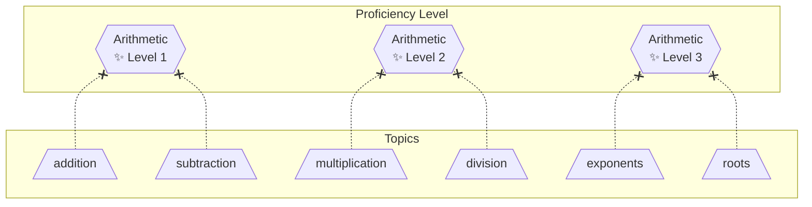
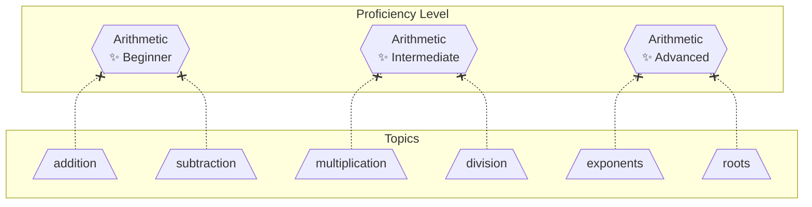
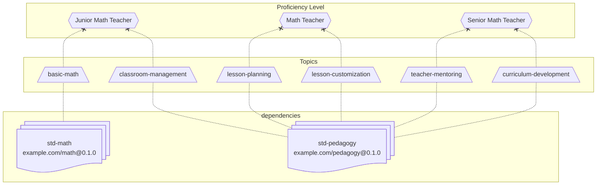

# Proficiency Level List

A **Proficiency Levels List** is a collection of [proficiency levels](proficiency-level.md) that imply order via their naming or their required proficiencies.

- Multiple proficiency level list may be applied in parallel, since they only provide an interpretation of the proficiency scores.

### Requirements

A proficiency levels list uses the same structure as a [topic list](topic-list.md).

- Uses the keyword `proficiency-levels` instead of `topics`.
- Same [identification](topic-list.md#topic-identifiers) requirements.
- Same [distribution](topic-list.md#distributable) requirements
- Same [signature](topic-list.md#signed) requirements.
- Same [dependencies](topic-list.md#dependencies) requirements.

### Arithmetic Level - Numeric



### Arithmetic Level - Categorical



# Examples

The below example defines required proficiencies (topics with a minimum score of `proficient`) for 3 levels of a "math teacher" role.

### YAML

<!-- prettier-ignore -->
```yaml
owner: "example.com"
name: "math-teacher-levels"
description: "..."
version: "0.1.0"
timestamp: "2026-01-26T01:00:00Z",
certificate: "-----BEGIN CERTIFICATE-----ABC123DEF456-----END CERTIFICATE-----",

proficiency-levels:
  math-teacher-junior:
    pretopics:
      - "std-math.basic-math"
      - "std-pedagogy.classroom-management"

  math-teacher:
    pretopics:
      - "std-pedagogy.lesson-planning"
      - "std-pedagogy.lesson-customization"

  math-teacher-senior:
    pretopics:
      - "std-pedagogy.teacher-mentoring"
      - "std-pedagogy.curriculum-development"

dependencies:
  std-math: "https://example.com/topics-lists/math.json@0.1.0"
  std-pedagogy: "https://example.com/topics-lists/pedagogy.json@0.1.0"
```

### JSON

<!-- prettier-ignore -->
```json
{
  "$schema": "https://raw.githubusercontent.com/openproficiency/model/refs/heads/main/schemas/proficiency-levels-list.schema.json",

  "owner": "example.com",
  "name": "math-teacher-levels",
  "description": "...",
  "version": "0.1.0",
  "timestamp": "2026-01-26T01:00:00Z",
  "certificate": "-----BEGIN CERTIFICATE-----ABC123DEF456-----END CERTIFICATE-----",

  "proficiency-levels": {
    "math-teacher-junior": {
      "pretopics": [
        "std-math.basic-math",
        "std-pedagogy.classroom-management"
      ]
    },

    "math-teacher": {
      "pretopics": [
        "std-pedagogy.lesson-planning",
        "std-pedagogy.lesson-customization"
      ]
    },

    "math-teacher-senior": {
      "pretopics": [
        "std-pedagogy.teacher-mentoring",
        "std-pedagogy.curriculum-development"
      ]
    }
  },

  "dependencies": {
    "std-math": "https://example.com/topics-lists/math.json@0.1.0",
    "std-pedagogy": "https://example.com/topics-lists/pedagogy.json@0.1.0"
  }
}
```


