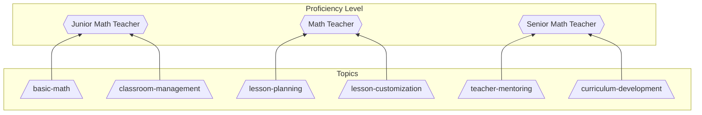
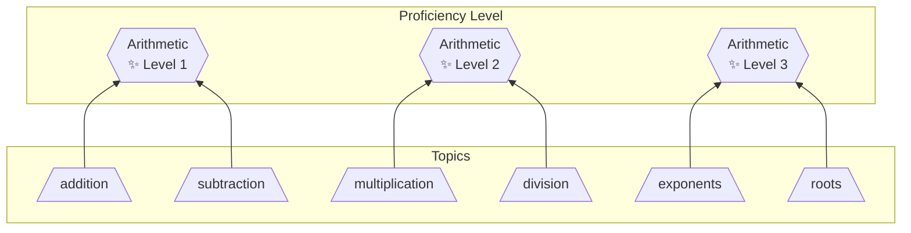

# Proficiency Level

A **Proficiency Level** is standardized interpretation for a collection of proficiency scores. This allows [issuers](issuer.md) to collaborate and provide a shared way of referring to [proficiency scores](proficiency-score.md) in their area of expertise.

Common use cases:

- Human friendly wording for a particular topic.
- Proficiency of a Job role.

> [!CAUTION]
> Proficiency levels must not represent [topics](topic-list.md) since they cannot be directly assigned a [score](proficiency-score.md).

## Definition

A proficiency level is defined similar to a [topic list](topic-list.md) except that it uses the keyword `proficiency-levels` instead of `topics`.

- It may only have pretopics, no subtopics.
- It may only reference [imported topics](topic-list.md), not other proficiency levels.
- It cannot be directly assigned a [score](proficiency-score.md).
- Multiple proficiency level definitions may be applied together. They only superimpose additional information.

### Example - YAML

The below example defines required proficiencies (topics with a minimum proficiency score) for 3 levels of a "math teacher" role.

```yaml
timestamp: "..."
issuer: "national-teachers-association"
signature: "..."
version: "..."
proficiency-levels:
  math-teacher-junior:
    pretopics:
      - "tcs:basic-math"
      - "nta:classroom-management"
  
  math-teacher:
    pretopics:
      - "nta:lesson-planning"
      - "nta:lesson-customization"
  
  math-teacher-senior:
    pretopics:
      - "nta:teacher-mentoring"
      - "nta:curriculum-development"

dependencies:
  tcs: the-core-standards
  nta: national-teachers-association
```

# Examples

## Math teacher job role



> [!NOTE]
> This example role may might pull from multiple topic lists from different domains, like mathematics and pedagogy.

## Arithmetic Level - Numeric



> [!NOTE]
> This role may align closely to a topic like `arithmetic` providing a more "human" way of referring to a user's proficiency in that area.


## Arithmetic Level - Categorical
