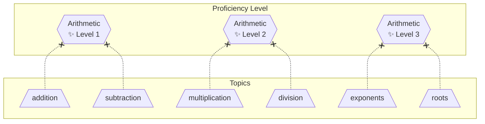

# Proficiency Level

A **Proficiency Level** is defined by a collection of [topics](topic.md) and
is typically one entry in a [Proficiency Level List](proficiency-level-list.md).

These levels serve as a standardized interpretation of those [proficiency scores](proficiency-score.md),
enabling [issuers](issuer.md) to more easily collaborate in their area of expertise.

Common use cases:

- Human friendly wording for a particular topic.
- Proficiency of a Job role.

### Requirements

- It may only have pretopics, no subtopics.
- It is considered "achieved" if all pretopics have a minimum proficiency score of `proficient`.
- It may only reference [imported topics](topic-list.md), not other proficiency levels.
- It cannot be directly assigned a [proficiency score](proficiency-score.md).



> [!CAUTION]
> Proficiency levels must not be used as [topics](topic-list.md) since they
> cannot be directly assigned a [score](proficiency-score.md).

# Example

### JSON

<!-- prettier-ignore -->
```json
{
  "id": "arithmetic-level-1",
  "description": "A fundamental understanding of quantities.",
  "pretopics": [
    "std-math.addition",
    "std-math.subtraction"
  ]
}
```

<!-- prettier-ignore -->
```json
{
  "id": "arithmetic-level-2",
  "description": "An intermediate understanding of quantities.",
  "pretopics": [
    "std-pedagogy.multiplication",
    "std-pedagogy.division"
  ]
}
```

> Note: Dependencies are not shown in the above examples, because they are provided in the proficiency levels list.
