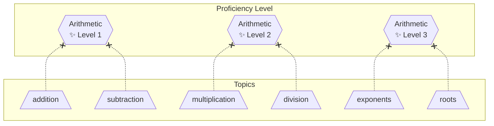
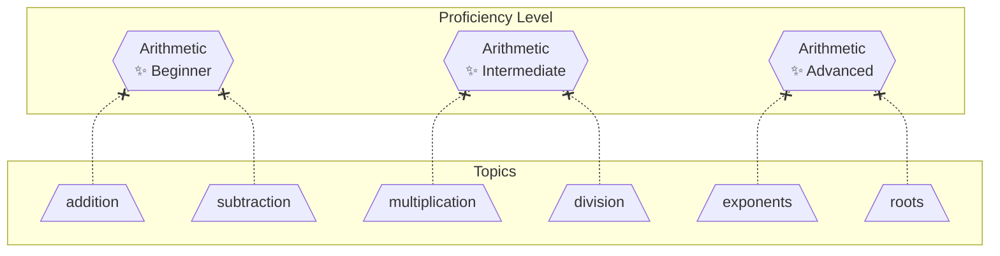
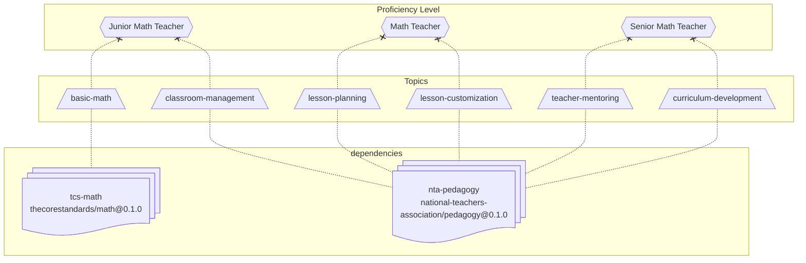

# Proficiency Level

A **Proficiency Level** is standardized interpretation for a collection of proficiency scores. This allows [issuers](issuer.md) to collaborate and provide a shared way of referring to [proficiency scores](proficiency-score.md) in their area of expertise.

Common use cases:

- Human friendly wording for a particular topic.
- Proficiency of a Job role.

> [!CAUTION]
> Proficiency levels must not represent [topics](topic-list.md) since they cannot be directly assigned a [score](proficiency-score.md).

## Definition

A proficiency level is defined similar to a [topic list](topic-list.md) except that it uses the keyword `proficiency-levels` instead of `topics`.

- It may only have pretopics, no subtopics.
- It may only reference [imported topics](topic-list.md), not other proficiency levels.
- It cannot be directly assigned a [score](proficiency-score.md).
- Multiple proficiency level definitions may be applied together. They only superimpose additional information.

### Arithmetic Level - Numeric



### Arithmetic Level - Categorical



# Examples

The below example defines required proficiencies (topics with a minimum score of `proficient`) for 3 levels of a "math teacher" role.

### YAML

```yaml
issuer: "national-teachers-association"
timestamp: "..."
certificate: "..."
version: "..."

proficiency-levels:
  math-teacher-junior:
    pretopics:
      - "tcs-math.basic-math"
      - "nta-pedagogy.classroom-management"

  math-teacher:
    pretopics:
      - "nta-pedagogy.lesson-planning"
      - "nta-pedagogy.lesson-customization"

  math-teacher-senior:
    pretopics:
      - "nta-pedagogy.teacher-mentoring"
      - "nta-pedagogy.curriculum-development"

dependencies:
  tcs-math: "https://thecorestandards.com/topics-lists/math.json@0.1.0"
  nta-pedagogy: "https://national-teachers-association.com/topics-lists/pedagogy.json@0.1.0"
```


