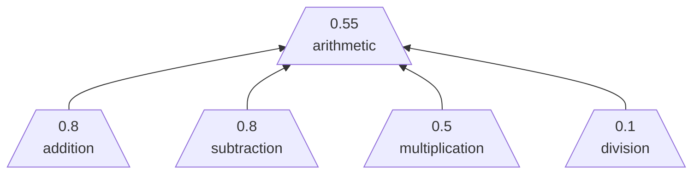

# Proficiency Score

A **Proficiency Score** is a number indicating the degree of understanding for a specific [topic](topic.md).

- The score is between `0.0` and `1.0`:
  - A score of `0.0` indicates "No awareness" of the topic.
  - A score `1.0` indicates "full understanding" of the topic.
- The default process is **implicit** scoring unless an **explicit** scoring process is defined.

## Implicit Scoring (default)

Some topics can be simple and hence obtain proficiency by familiarity and basic usage.

- `0.0`: Unaware - Does not know of the topic's existence.
- `0.1`: Aware - Ability to recognize the topic.
- `0.5`: Familiar - Theoretical understanding.
- `0.8`: Applied - Has practically used the knowledge.
  - Minimum threshold for use as a [pretopic](topic.md#types-of-topics).
- `1.0`: Proficient - Used enough to consider "fundamental".

> [!IMPORTANT]
> The score between **applied** (0.8) and **proficient** (1.0) is subjective. This provides room for customization. Example: A scoring process considering **recency** or **complexity**.

## Upward Score Propagation

A topic calculates its score from its subtopics. It is the normalized sum of the subtopics.

Explanation:

`0.55` = (`0.8` + `0.8` + `0.5` + `0.1`) / 4

> [!NOTE]
> In any single topic, there is likely an implied order. Since the subtopic space is small, it is an acceptable tradeoff easier organization. Alternately, a hyper-specific topic structure could be created, if required. Example: It would probably be very helpful to understand `addition` before learning `multiplication`.

## Downward Score Propagation

Assigning a score to a group topic affects all of its subtopics equally.

- Propagation does not affect **pretopics**.

> [!NOTE]
> Theoretically, proficiency should propagate to pre-topics.
> This is a limitation that is being investigated. Idea: have a binary flag to allow propagation to pretopics.

# Explicit Scoring

Explicit scoring can be helpful for getting started. In the beginning, it may be burdensome or impossible to confidently define the topics and relationships via subtopics/pretopics.

In this case, a topic can be internally organized into phases. As each phase is completed the proficiency score is increased.

- The max possible explicit score is `0.8`.
- A phase is complete if all its topics have a minimum score of `0.8`.

> [!IMPORTANT]
> Downward score propagation does not apply to explicit scoring.

### Example

