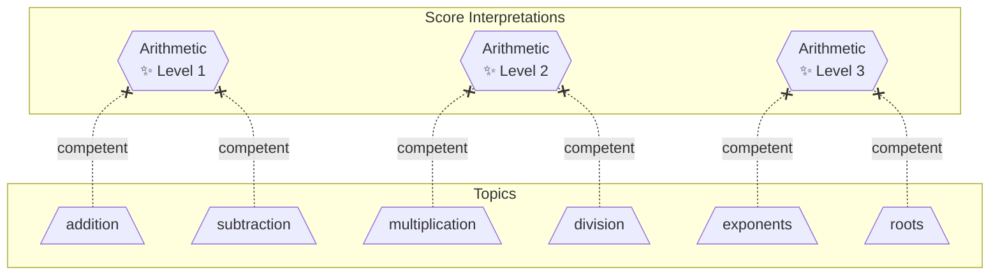
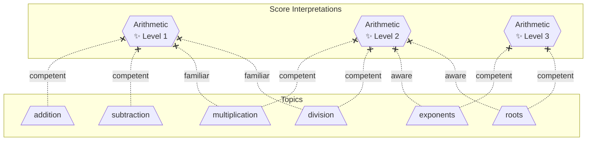
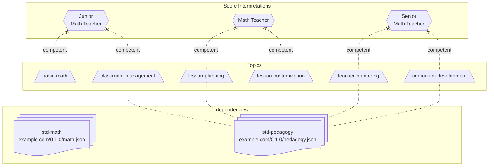
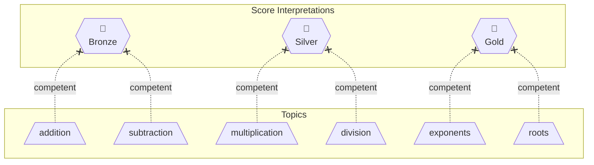
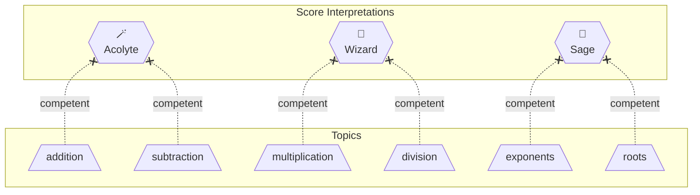

# Score Interpretation List

A **Score Interpretation List** is a collection of [score interpretations](score-interpretation.md) that imply order via their naming or required proficiencies.

## Required content

- Name - A namespace to associate the topics. Case insensitive. No special characters.
- Description - A brief description of the knowledge domain covered by this topic list.
- Version - Any indicator to unique identify the version of the list.
- Issuer - The owner of this topic list.
- Timestamp - The time with the list was created and assigned a version number.
- Certificate - Verification from the issuer that the list is unmodified.
- Score Interpretations - A dictionary of [score interpretation](score-interpration.md) objects.
- Dependencies - A list of URIs to required topic lists.

## Signed

If distributed, the list is signed by the issuer with each release of a version to enable verification.

- Prevents misinterpretation of [transcript records](transcript-entry.md).
- Encourages a preferred recommendation from **issuers** of a related [topic list](topic-list.md).

## Distributable

Unlike [topic lists](topic-list.md), an interpretation list only needs to be distributed to required consumers.

- Enables both standard public definitions and private internal-only definitions.
- It is served to the audience with minimal restriction.

This enables:

- Shared interpretation by multiple parties
- Discourages conflicting definitions.
- Combining different interpretations.

## Examples

### Simple Progression - Arithmetic

The below example shows a simple example where only `competent` requirements are specified.



<details>
<summary>Show YAML</summary>

```yaml
owner: example.com
name: math-levels
description: Mathematics Proficiency Levels
version: 0.1.0
timestamp: 2026-01-26T01:00:00Z
certificate: -----BEGIN CERTIFICATE-----ABC123DEF456-----END CERTIFICATE-----

score-interpretations:
  arithmetic-1:
    name: Arithmetic - Level 1
    description: Practical experience with addition and subtraction.
    requirements:
      math.addition: competent
      math.subtraction: competent

  arithmetic-2:
    name: Arithmetic - Level 2
    description: Practical experience with multiplication and division.
    requirements:
      math.multiplication: competent
      math.division: competent

  arithmetic-3:
    name: Arithmetic - Level 3
    description: Practical experience with multiplication and division.
    requirements:
      math.exponents: competent
      math.roots: competent

dependencies:
  math: https://example.com/0.1.0/math.json
```

Information

</details>

### Guided Progression - Arithmetic

The below example shows requiring `familiar` scores in topics before actually practicing them in the next level where they then gain `competent` scores.



<details>
<summary>Show YAML</summary>

```yaml
owner: example.com
name: math-levels
description: Mathematics Proficiency Levels
version: 0.1.0
timestamp: 2026-01-26T01:00:00Z
certificate: -----BEGIN CERTIFICATE-----ABC123DEF456-----END CERTIFICATE-----

score-interpretations:
  arithmetic-1:
    name: Arithmetic - Level 1
    description: Practical experience with addition and subtraction. Prepared to start Arithmeetic - Level 2.
    requirements:
      math.addition: competent
      math.subtraction: competent
      # Prepare for next level
      math.multiplication: familiar
      math.division: familiar

  arithmetic-2:
    name: Arithmetic - Level 2
    description: Practical experience with multiplication and division. Prepared to start Arithmeetic - Level 3.
    requirements:
      math.multiplication: competent
      math.division: competent
      # Prepare for next level
      math.exponents: aware
      math.roots: aware

  arithmetic-3:
    name: Arithmetic - Level 3
    description: Practical experience with multiplication and division.
    requirements:
      math.exponents: competent
      math.roots: competent

dependencies:
  math: https://example.com/0.1.0/math.json
```

</details>

### Job Roles - Math Teacher

Below is an example of defining internal requirements for "Math Teacher" job roles for a school.



<details>
<summary>Show YAML</summary>

```yaml
owner: example.com
name: math-teacher-levels
description: Internal definition of math teacher proficiency.
version: "0.1.0"
timestamp: "2026-01-26T01:00:00Z",
certificate: "-----BEGIN CERTIFICATE-----ABC123DEF456-----END CERTIFICATE-----",

score-interpretations:
  math-teacher-junior:
    name: JR. Math Teacher
    description: Able to support another teacher with all content.
    requirements:
      std-math.basic-math: comptent
      std-pedagogy.classroom-management: competent

  math-teacher:
    name: Math Teacher
    description: Able to teach a classroom alone.
    requirements:
      std-pedagogy.lesson-planning: competent
      std-pedagogy.lesson-customization: competent

  math-teacher-senior:
    name: Sr. Math Teacher
    description: Actively building course curriculum and supporting other staff.
    requirements:
      std-pedagogy.teacher-mentoring: comptent
      std-pedagogy.curriculum-development: comptent

dependencies:
  std-math: "https://example.com/topics-lists/0.1.0/math.json"
  std-pedagogy: "https://example.com/topics-lists/0.1.0/pedagogy.json"
```

</details>

### Badges - Gold/Silver/Bronze

Below is an interpretation of `math` scores to award bronze/silver/gold badges.



<details>
<summary>Show YAML</summary>

```yaml
owner: example.com
name: math-badges
description: Mathematics badges themed metals.
version: 0.1.0
timestamp: 2026-01-26T01:00:00Z
certificate: -----BEGIN CERTIFICATE-----ABC123DEF456-----END CERTIFICATE-----

score-interpretations:
  1-bronze:
    name: Bronze
    description: Numbers and what they can do.
    requirements:
      math.addition: competent
      math.subtraction: competent

  2-silver:
    name: Silver
    description: Mastery of the basics.
    requirements:
      math.multiplication: competent
      math.division: competent

  3-gold:
    name: Gold
    description: The best of the best!
    requirements:
      math.exponents: competent
      math.roots: competent

dependencies:
  math: https://example.com/0.1.0/math.json
```

</details>

### Badges - Magic

Below is an interpretation of `math` scores into playful badges in the real of magic.



<details>
<summary>Show YAML</summary>

```yaml
owner: example.com
name: math-badges-magic
description: Mathematics badges themed in the world of magic and spells.
version: 0.1.0
timestamp: 2026-01-26T01:00:00Z
certificate: -----BEGIN CERTIFICATE-----ABC123DEF456-----END CERTIFICATE-----

score-interpretations:
  1-acolyte:
    name: Acolyte
    description: Numbers and the magic they contain.
    requirements:
      math.addition: competent
      math.subtraction: competent

  2-wizard:
    name: Wizard
    description: The powers of quanity and manipulation.
    requirements:
      math.multiplication: competent
      math.division: competent

  3-sage:
    name: Sage
    description: A wizard of numerical calculation!
    requirements:
      math.exponents: competent
      math.roots: competent

dependencies:
  math: https://example.com/0.1.0/math.json
```

</details>
