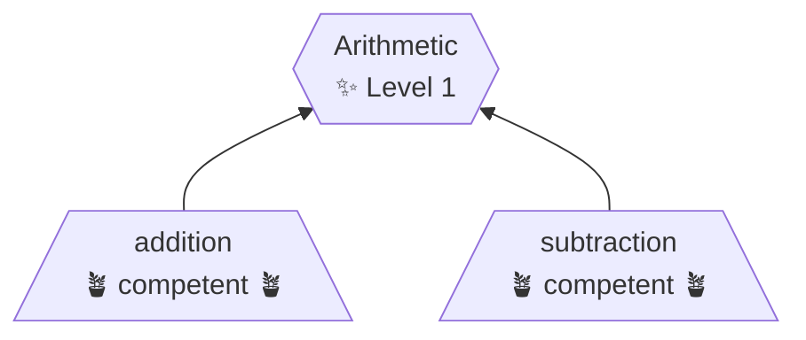

# Score Interpretation

A **Score Interpretation** is defined by a collection of [topic scores](topic-score.md) and
is typically one of several in a [Score Interpretation List](score-interpretation-list.md).

A score interpretation serves as a standardized way for [issuers](issuer.md) to refer to a user's proficiency in their knowledge domain. It additionally enables partners and collaborators to use shared conventions.

- It may reference [topics](topic.md) from multiple [topic lists](topic-list.md).
- Higher scores also fulfill lower requirements. Examples:
  - A score of `competent` also fulfills a requirement for `familiar` or `aware`.
  - A score of `familiar` does not fulfill a requirement for `competent`.
- It cannot reference other interpretations.
- It cannot be directly assigned a [score](topic-score.md).



> [!CAUTION]
> Interpretations must not be used as [topics](topic-list.md) since they
> cannot be directly assigned a [score](topic-score.md).

## Typical Usage

- Knowledge levels for a company's product or service
- Roles for a common job in industry
- Roles for an internal job type
- Badging and micro-credentials
- Alternative wording for marketing/display purposes

## Requirements

- ID - A unique identifier for tracking
- Name - A friendly name used for display
- Description - A short description of the interpretation.
- Requirements - A set of topics and required scores.

# Examples

### Simple Format

```yaml
id: arithmetic-1
name: Arithmetic - Level 1
description: Practical experience with addition and subtraction. Prepared to start Arithmetic Level 2
requirements:
  math.addition: competent
  math.subtraction: competent
  math.multiplication: aware
  math.division: aware
```

### Grouped Format (beta)

This is a proposed format to allow grouping of requirements. It is not yet supported.

- Flexibility to organize in a way that maps to your ecosystem
  - Example: Learning modules are often defined by their "learning objectives".
- Ability to report by requirement set ID.

```yaml
id: arithmetic-1
name: Arithmetic - Level 1
description: Practical experience with addition and subtraction. Prepared to start Arithmetic Level 2
requirements:
  requirement-1: # Any ID is valid
    description: Applied use of addition and subtraction
    requirements:
      math.addition: competent
      math.subtraction: competent

  requirement-2: # Any ID is valid
    description: Introduced to multiplication and division
    requirements:
      math.multiplication: aware
      math.division: aware
```

> [!NOTE]
> Dependencies are not shown in the above example, because they are provided in the score interpretation list.
