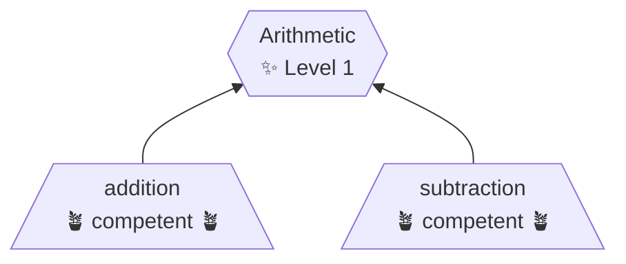

# Score Interpretation

A **Score Interpretation** is defined by a collection of [topic scores](topic-score.md) and
is typically one of several in a [Score Interpretation List](score-interpretation-list.md).

A score interpretation serves as a standardized way for [issuers](issuer.md) to refer to a user's proficiency in their knowledge domain. It additionally enables partners and collaborators to use shared conventions.

- It may reference [topics](topic.md) from multiple [topic lists](topic-list.md).
- Higher scores also fulfill lower requirements. Examples:
  - A score of `competent` also fulfills a requirement for `familiar` or `aware`.
  - A score of `familiar` does not fulfill a requirement for `competent`.
- It cannot reference other interpretations.
- It cannot be directly assigned a [score](topic-score.md).


```mermaid
flowchart BT

%% Interpretations
arithmetic-level-1{{"Arithmetic<br/>✨ Level 1"}}

%% Topic Scores
addition[/addition<br/>🪴 competent 🪴\]
subtraction[/subtraction<br/>🪴 competent 🪴\]

%% Mapping
addition --> arithmetic-level-1
subtraction --> arithmetic-level-1
```

> [!CAUTION]
> Interpretations must not be used as [topics](topic-list.md) since they
> cannot be directly assigned a [score](topic-score.md).

## Typical Usage

- Knowledge levels for a company's product or service
- Roles for a common job in industry
- Roles for an internal job type
- Badging and micro-credentials
- Alternative wording for marketing/display purposes

## Interpretation Requirements

- ID - A unique identifier for tracking
- Name - A friendly name used for display
- Description - A short description of the interpretation.
- Requirements - A collection of logical expressions and topic scores.

## Logical Operations (Optional)

The `requirements` field supports basic inclusive logical expressions.

- If no expression is declared, the default is `all`.
- Expressions can be nested.
- Expressions may optionally include a non-numeric unique identifier as a suffix. Examples: `all-abc1`, `any-abc2`, `at-least-3-abc3`

| Operator     | Description                                |
| ------------ | ------------------------------------------ |
| `all`        | All expressions must be satisfied          |
| `any`        | At least one expression must be satisfied  |
| `at-least-N` | At least `N` expressions must be satisfied |

### Lack of Competency (unsupported)

Interpretations are meant to identify competency, not lack of competency.

As such, exclusive expressions like `not` or `none-of` are deliberately not supported.
This prevents using interpretations as a blocking mechanism.

### Invalid Syntax

```yaml
id: arithmetic-1
name: Arithmetic - Level 1
description: Practical experience with addition and subtraction, but definitely not capable of multiplication and division
requirements:
  all:
    math.addition: competent
    math.subtraction: competent
  not: # Negative competency is not supported
    math.multiplication: competent
    math.division: competent
```

# Examples

> [!NOTE]
> Dependencies are not shown in the below examples, because they are specified in the score interpretation list.

### ALL - Every topic score is required

The user must know how to use both addition and subtraction, and already be aware that multiplication and division exist.

#### Implicit ALL

```yaml
id: arithmetic-1
name: Arithmetic - Level 1
description: Practical experience with addition and subtraction. Prepared to start Arithmetic Level 2
requirements:
  math.addition: competent
  math.subtraction: competent
  math.multiplication: aware
  math.division: aware
```

#### Explicit ALL

```yaml
id: arithmetic-1
name: Arithmetic - Level 1
description: Practical experience with addition and subtraction. Prepared to start Arithmetic Level 2
requirements:
  all: # Explicitly declared
    math.addition: competent
    math.subtraction: competent
    math.multiplication: aware
    math.division: aware
```

### ANY — At least one topic score is required

A "getting started badge" awarded when the user has learned at least 1 of the 2 requirements.

```yaml
id: math-fan
name: Math - getting started star
description: Students get a star for completing at least 1 lesson.
requirements:
  any:
    math.addition: familiar
    math.subtraction: familiar
```

### AT-LEAST-N — Some of the topic scores are required

The user must satisfy at least 3 of the listed requirements.

```yaml
id: math-presenter
name: Math Presenter
description: Can present math lessons using at least 3 of 4 available classroom surfaces.
requirements:
  at-least-3:
    pedagogy.chalk-board: competent
    pedagogy.white-board: competent
    pedagogy.projector: competent
    pedagogy.touch-screen: competent
```

### Nested Logic — Combining ALL/ANY

A math tutor qualification where the candidate must be competent in core arithmetic AND must demonstrate ability in 1 advanced area.

```yaml
id: math-tutor-1
name: Math Tutor Level 1
description: Qualified to tutor students in arithmetic plus at least one advanced branch.
requirements:
  all:
    math.addition: competent
    math.subtraction: competent
    math.multiplication: competent
    math.division: competent
  any:
    math.trigonometry: competent
    math.calculus: competent
```

```yaml
id: math-tutor-2
name: Math Tutor Level 2
description: Qualified to tutor multiple students in arithmetic plus at least one advanced branch.
requirements:
  all-math:
    all-fundamentals: # Fundamental math subjects
      math.addition: competent
      math.subtraction: competent
      math.multiplication: competent
      math.division: competent
    any-advanced: # At least one advanced math subject
      math.trigonometry: competent
      math.calculus: competent
  all-pedagogy:
    pedagogy.curriculum-development: familiar
    pedagogy.classroom-management: familiar
```

<details>
<summary>💡 Tip: This can be simplified with implicit ALL</summary>

```yaml
id: math-tutor-2
name: Math Tutor Level 2
description: Qualified to tutor multiple students in arithmetic plus at least one advanced branch.
requirements:
  # Math requirements
  all-fundamentals: # Fundamental math subjects
    math.addition: competent
    math.subtraction: competent
    math.multiplication: competent
    math.division: competent
  any-advanced: # At least one advanced math subject
    math.trigonometry: competent
    math.calculus: competent
  # Pedagogy requirements
  pedagogy.curriculum-development: familiar
  pedagogy.classroom-management: familiar
```

</details>
