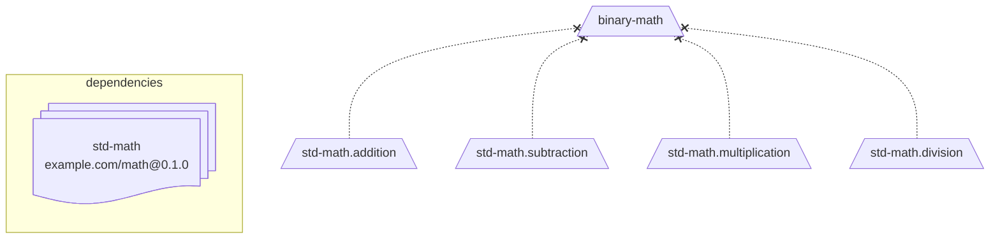
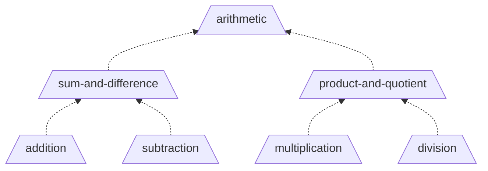
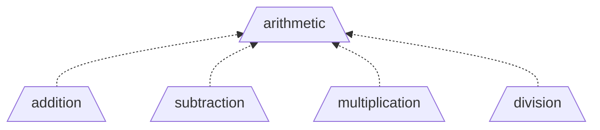

# Topic List

A **Topic list** is the collection of [topics](topic.md) that define a knowledge domain declared by a particular **issuer**.

## Required content

The following content must be included in the list.

- Name - A namespace to associate the topics. Case insensitive. No special characters.
- Description - A brief description of the knowledge domain covered by this topic list.
- Version - Any indicator to unique identify the version of the list.
- Issuer - The owner of this topic list.
- Timestamp - The time with the list was created and assigned a version number.
- Certificate - Verification from the issuer that the list is unmodified.
- Topics - A dictionary of [Topic](topic.md) objects.
- Dependencies - A list of URIs to required topic lists.

## Topic Identifiers

Because all [topics](topic.md) have the same significance, any hierarchy implied from its
position in the list should not be considered rigid. All identifiers must be fully unique
within the namespace of the topic list.

This provides:

- downstream topic lists can reference topics without long notation
- reorganization of topics without breaking changes (need to recompute proficiency scores)

## Signed

The topic list is signed by the issuer with each release of a version to enable verification.

- Prevents tampering of [transcript records](transcript-entry.md).
- Prevents record loss if an **issuer** is no longer available.

## Distributable

A topic list originates from the issuer.

- It is served **publicly** with minimal restriction.
- It may be redistributed by other parties.

This enables:

- Shared schema by multiple parties, discouraging overlap.
- Redundancy through storage across multiple services.

## Dependencies

A list may import topics from another list by declaring it as a dependency.

- Imported topics may only be used as pretopics.
- The dependency source is provided as a full URL, including version. Example `https://example.com/math.json@0.1.0`
- Dependencies are assigned a local namespace and referenced using `.` notation.
- All direct and imported topics may be assigned proficiency scores.

The below example illustrates importing a `math` list, and assigning it the local `std-math` namespace.
It then creates an owned topic called `binary-math` that uses topics from that list.



## List Evolution

### Non-breaking changes

The topic list system is intended to be flexible within a single namespace, providing space
to reorganize topics, subtopics, and pretopics with little or no effect on proficiency scores.

#### Example - reorganizing

The below example shows remove of an unnecessary middle layer.

Before



After



### Breaking changes

As a topic list evolves, it may become necessary to modify an existing topic identifier.
Because proficiency scores are stored against a topic's identifier, it would break existing scores.

In this case, a migration process is required:

1. Consume existing transcript entries according to the old schema.
2. Transfer scores from the older topic list schema to the new topic list schema.
3. Reissue new transcript entries.

# Examples

### JSON

The below example imports a standard `math` list, then
defines several prerequisites from common math for understanding binary math.

<!-- prettier-ignore -->
```json
{
  "$schema": "https://raw.githubusercontent.com/openproficiency/model/refs/heads/main/schemas/topic-list.schema.json",
  
  "owner": "example.com",
  "name": "binary-math",
  "description": "Mathematics in binary for electrical circuits.",
  "version": "0.1.0",
  "timestamp": "2026-01-26T01:00:00Z",
  "certificate": "-----BEGIN CERTIFICATE-----ABC123DEF456-----END CERTIFICATE-----",

  "topics": {
    "binary-addition": {
      "description": "Combining of 2 or more numbers.",
      "pretopics": ["std-math.addition"]
    },
    "binary-subtraction": {
      "description": "Taking one number or quantity away from another.",
      "pretopics": ["std-math.subtraction"]
    },
    "binary-multiplication": {
      "description": "The total of one number added to itself a specific number of times.",
      "pretopics": ["std-math.multiplication"]
    },
    "binary-division": {
      "description": "Splitting a number into equal parts.",
      "pretopics": ["std-math.division"]
    },
    "binary-arithmetic": {
      "description": "Application of electrical circuits to perform basic math operations.",
      "subtopics": [
        "binary-addition",
        "binary-subtraction",
        "binary-multiplication",
        "binary-division"
      ]
    }
  },

  "dependencies": {
    "std-math": "https://example.com/math.json@0.1.0"
  }
}
```

### YAML

The below example imports the `math` list. It uses the arithmetic-related topics from it instead of self-defining.

```yaml
owner: "example.com"
name: "binary-math"
description: "Mathematics in binary for electrical circuits."
version: "0.1.0"
timestamp: "2026-01-26T01:00:00Z"
certificate: ""-----BEGIN CERTIFICATE-----ABC123DEF456-----END CERTIFICATE-----""

topics:
  binary-addition:
    description: Combining of 2 or more numbers.
    pretopics:
      - std-math.addition
  binary-subtraction:
    description: Taking one number or quantity away from another.
    pretopics:
      - std-math.subtraction
  binary-multiplication:
    description: The total of one number added to itself a specific number of times.
    pretopics:
      - std-math.multiplication
  binary-division:
    description: Splitting a number into equal parts.
    pretopics:
      - std-math.division
  binary-arithmetic:
    description: Application of electrical circuits to perform basic math operations.
    subtopics:
      - binary-addition
      - binary-subtraction
      - binary-multiplication
      - binary-division

dependencies:
  std-math: https://example.com/math.json@0.1.0
```
