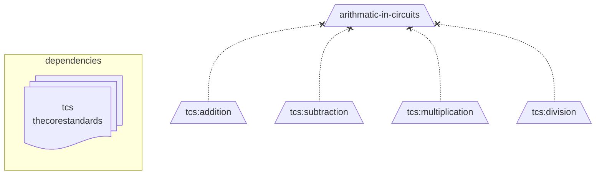

# Topic List

A **Topic list** is the collection of [topics](experience-topic.md) that define a knowledge domain declared by a particular **issuer**.

## Required content

The following content must be included in the list.

- Issuer
- Signature
- Version
- Topics List
- Timestamp

## Signed

The topic list is signed by the issuer with each release of a version to enable verification.

- Prevents tampering of [transcript records](transcript-entry.md).
- Prevents record loss if an **issuer** is no longer available.

## Distributable

A topic list originates from the issuer.

- It is served **publicly** with minimal restriction.
- It may be redistributed by other parties.

This enables:

- Shared schema by multiple parties, discouraging overlap.
- redundancy throughs storage across multiple services.

## Dependencies

A list may import topics from another list by declaring it as a dependency.

- A dependency is indicated using a colon `:`.
- Dependencies may be used in full name or assigned a shorthand reference.
- Imported topics may only be used as pretopics.
- All direct and imported topics may be assigned proficiency scores.

The below example illustrates importing the `thecorestandards` list, then assigns `tcs` as shorthand.
It then creates an owned topic called `arithmatic-in-circuits` that uses topics from that list.



# Examples

### Simple table

The topic list can be shared as a simple `.csv` in a table format.

| topic          | subtopics                                       | pretopics |
| -------------- | ----------------------------------------------- | --------- |
| numbers        | -                                               | -         |
| addition       | -                                               | numbers   |
| subtraction    | -                                               | numbers   |
| multiplication | -                                               | numbers   |
| division       | -                                               | numbers   |
| arithmatic     | addition, subtraction, multiplication, division | -         |

### JSON

The below example imports `thecorestandards` list. It uses the `numbers` topic to define arithmatic-related topics.

<!-- prettier-ignore -->
```json
{
  "issuer": "...",
  "signature": "...",
  "version": "...",
  "timestamp": "...",
  "topics": {
    "addition": {
      "pretopics": ["tcs:numbers"]
    },
    "subtraction": {
      "pretopics": ["tcs:numbers"]
    },
    "multiplication": {
      "pretopics": ["tcs:numbers"]
    },
    "division": {
      "pretopics": ["tcs:numbers"]
    },
    "arithmatic-in-circuits": {
      "subtopics": [
        "addition",
        "subtraction",
        "multiplication",
        "division"
      ]
    }
  },
  "dependencies": {
    "tcs": "thecorestandards"
  }
}
```

### YAML

The below example imports `thecorestandards` list. It uses the arithmatic-related topics from it instead of self-defining.

```yaml
timestamp: "..."
issuer: "..."
signature: "..."
version: "..."
topics:
  arithmatic-in-circuits:
    subtopics:
      - tcs:addition
      - tcs:subtraction
      - tcs:multiplication
      - tcs:division
dependencies:
  tcs: thecorestandards
```
