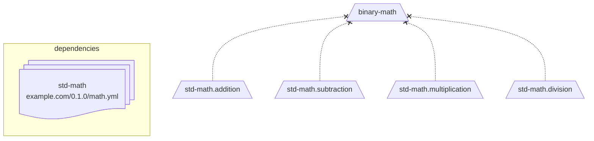
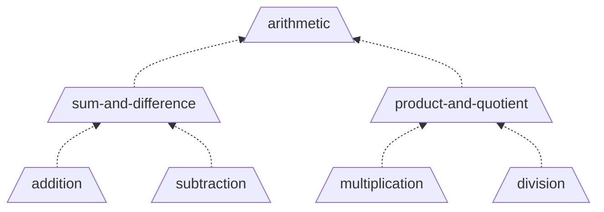
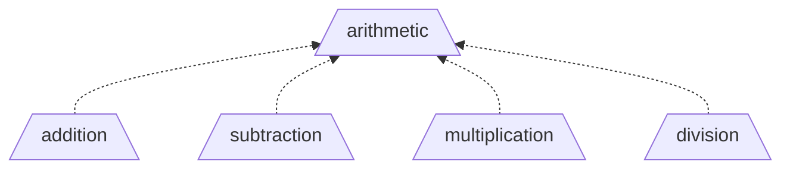

# Topic List

A **Topic list** is the collection of [topics](topic.md) that define a knowledge domain declared by a particular **issuer**.

## Required content

The following content must be included in the list.

- Name - A namespace to associate the topics. Case insensitive. No special characters.
- Description - A brief description of the knowledge domain covered by this topic list.
- Version - Any indicator to unique identify the version of the list.
- Issuer - The owner of this topic list.
- Issued At - The time when the list was created and assigned a version number.
- Certificate - Verification from the issuer that the list is unmodified.
- Topics - A dictionary of [Topic](topic.md) objects.
- Dependencies - A dictionary of aliases to required topic lists (shorthand or long form).

## Topic Identifiers

Because all [topics](topic.md) have the same significance, any hierarchy implied from its
position in the list should not be considered rigid. All identifiers must be fully unique
within the namespace of the topic list.

This provides:

- downstream topic lists can reference topics without long notation
- reorganization of topics without breaking changes (need to recompute scores)

## Signed

The topic list is signed by the issuer with each release of a version to enable verification.

- Prevents tampering of [transcript records](transcript-entry.md).
- Prevents record loss if an **issuer** is no longer available.

> [!NOTE]
> Dependency [`locations`](#dependency-locations) are excluded from the signature, since they are mutable redistribution pointers rather than part of the list's identity.

## Distributable

A topic list originates from the issuer.

- It is served **publicly** with minimal restriction.
- It may be redistributed by other parties.
- It may be served from any URL.
  - Example: https://example.com/topic-lists/0.1.0/math.yml
  - Example: https://example.com/math.json?v=0.1.0
  - Example: https://example.com?list=math&v=0.1.0&f=json

This enables:

- Shared schema by multiple parties, discouraging overlap.
- Redundancy through storage across multiple services.

> [!TIP]
> If a list uses another as dependency, it is recommended to use the original hosted URL. This will reduce the chance of breaking changes on the consuming list because a dependency was moved.

## Dependencies

A list may import topics from another list by declaring it as a dependency.

- Imported topics may only be used as pretopics.
- Dependencies are assigned a local namespace and referenced using `.` notation.
- All direct and imported topics may be assigned scores.

The below example illustrates importing a `math` list, and assigning it the local `std-math` namespace.
It then creates an owned topic called `binary-math` that uses topics from that list.


```mermaid
flowchart BT

  binary-math[/"binary-math"\]

    addition[/"std-math.addition"\] -.-x binary-math
    subtraction[/"std-math.subtraction"\] -.-x binary-math
    multiplication[/"std-math.multiplication"\] -.-x binary-math
    division[/"std-math.division"\] -.-x binary-math

  %% Dependencies
  subgraph dependencies
    std-math@{ shape: docs, label: "std-math<br/>example.com/0.1.0/math.yml" }
  end
```

### Dependency locations

Since topic lists are distributable, they must be specified using their fully qualified name and version. Urls to possible locations are optional.

A dependency can be declared in one of two forms:

**Shorthand** — a single string with the fully qualified name (`owner/name@version`) resolved via a registry.

```yaml
dependencies:
  std-math: example.com/math@0.1.0
```

**Long form** — explicit fields for the owner, name, and version. This form may optionally include a `locations` list of exact URLs, removing dependency on any registry.

```yaml
dependencies:
  std-math:
    topic-list-owner: example.com
    topic-list-name: math
    topic-list-version: 0.1.0
```

```yaml
dependencies:
  std-math:
    topic-list-owner: example.com
    topic-list-name: math
    topic-list-version: 0.1.0
    locations:
      - https://example.com/0.1.0/math.yml
```

> [!IMPORTANT]
> The `locations` field is **not** included in the issuer's [certificate](#signed) verification.
> Because a list is redistributable, its locations may be amended or extended by any party without invalidating the signature.
> A dependency's identity and integrity are established by its fully qualified name and version, not by where it is hosted.

## List Evolution

### Non-breaking changes

The topic list system is intended to be flexible within a single namespace, providing space
to reorganize topics, subtopics, and pretopics with little or no effect on scores.

#### Example - reorganizing

The below example shows remove of an unnecessary middle layer.

Before


```mermaid
flowchart BT

arithmetic[/"arithmetic"\]
  sum-and-difference -.-> arithmetic
  product-and-quotient -.-> arithmetic

sum-and-difference[/"sum-and-difference"\]
  addition[/"addition"\] -.-> sum-and-difference
  subtraction[/"subtraction"\] -.-> sum-and-difference

product-and-quotient[/"product-and-quotient"\]
  multiplication[/"multiplication"\] -.-> product-and-quotient
  division[/"division"\] -.-> product-and-quotient
```

After


```mermaid
flowchart BT

  arithmetic[/"arithmetic"\]

    addition[/"addition"\] -.-> arithmetic
    subtraction[/"subtraction"\] -.-> arithmetic
    multiplication[/"multiplication"\] -.-> arithmetic
    division[/"division"\] -.-> arithmetic
```

### Breaking changes

As a topic list evolves, it may become necessary to modify an existing topic identifier.
Because scores are stored against a topic's identifier, it would break existing scores.

In this case, a migration process is required:

1. Consume existing transcript entries according to the old schema.
2. Transfer scores from the older topic list schema to the new topic list schema.
3. Reissue new transcript entries.

### Validity Period

The topic list system is intended to support both stable and rapidly evolving knowledge spaces.
All [topics](topic-list.md) provide a **recommended** score validity period (default: 2 years) for use when assigning [transcript entries](transcript-entry.md).

# Examples

The below example imports a standard `math` list.
It then uses them as common math as prerequisites for understanding binary math.

```yaml
$schema: https://raw.githubusercontent.com/openproficiency/model/refs/heads/main/schemas/topic-list.schema.json

owner: example.com
name: binary-math
description: Mathematics in binary for electrical circuits.
version: 0.1.0
issued-at: 2026-01-26T01:00:00Z
certificate: -----BEGIN CERTIFICATE-----ABC123DEF456-----END CERTIFICATE-----

topics:
  binary-addition:
    description: Combining of 2 or more numbers.
    pretopics:
      - std-math.addition

  binary-subtraction:
    description: Taking one number or quantity away from another.
    pretopics:
      - std-math.subtraction

  binary-multiplication:
    description: The total of one number added to itself a specific number of times.
    pretopics:
      - std-math.multiplication

  binary-division:
    description: Splitting a number into equal parts.
    pretopics:
      - std-math.division

  binary-arithmetic:
    description: Application of electrical circuits to perform basic math operations.
    subtopics:
      - binary-addition
      - binary-subtraction
      - binary-multiplication
      - binary-division

dependencies:
  std-math: example.com/math@0.1.0
```
