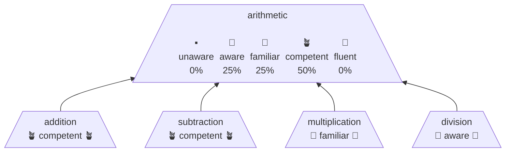
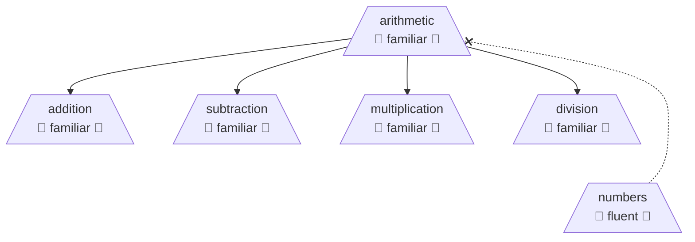
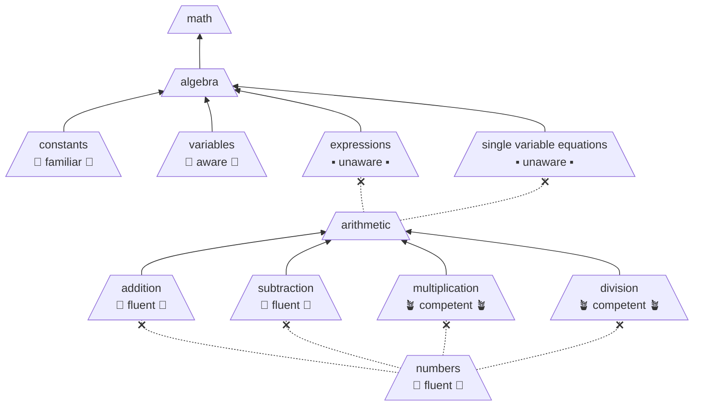
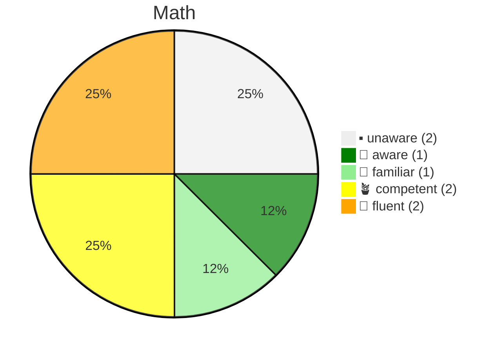
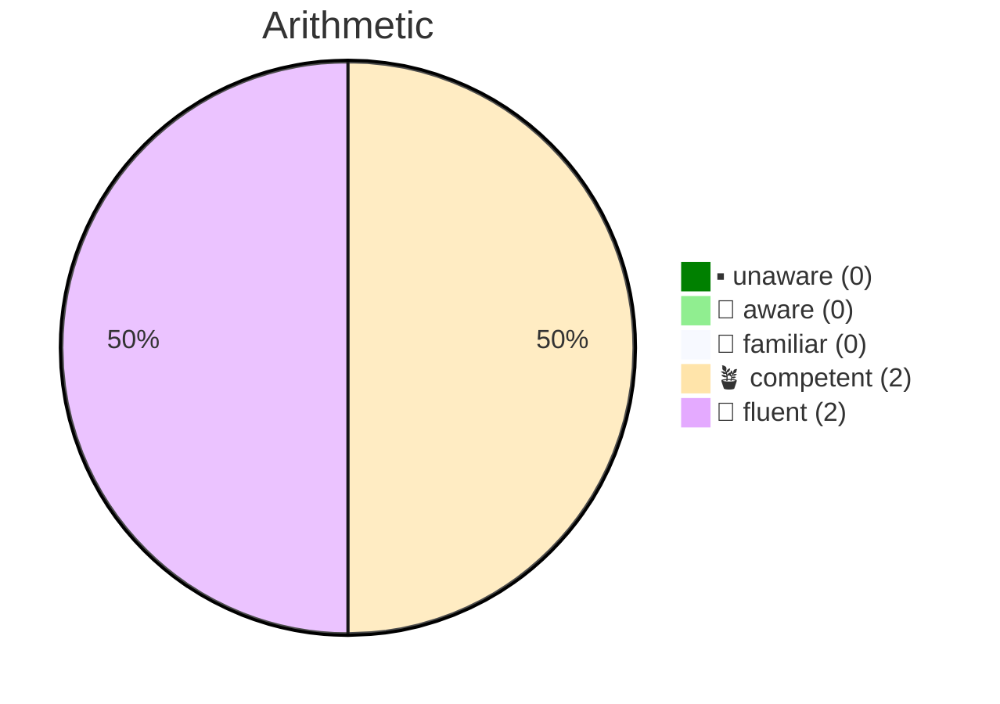
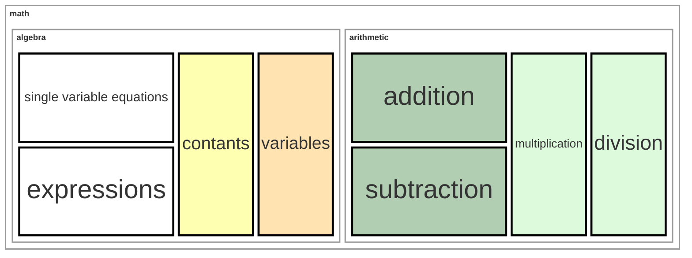

# Topic Score

A **Topic Score** is an assessment indicating the degree of understanding for a specific [topic](topic.md), from no awareness of the subject to fluent usage of it.

## Score Options

Some topics can be simple and hence obtain proficiency by familiarity and basic usage.

- `Unaware`: Does not know of the topic's existence.
- `Aware`: Ability to recognize the topic.
- `Familiar`: Theoretical understanding.
- `Competent`: Practically apply in standard scenarios.
  - Minimum threshold for use as a [pretopic](topic.md#types-of-topics).
- `Fluent`: Can consistently apply in new scenarios.

## Upward Score Propagation

If a topic has subtopics, its score is calculated from its subtopics.

Explanation:

`0% unaware` = 0 / 4  
`25% aware` = 1 / 4  
`25% familiar` = 1 / 4  
`50% competent` = 2 / 4  
`0% fluent` = 0 / 4

## Downward Score Propagation

Assigning a score to a group topic affects all of its **subtopics** equally. However, **pretopics** are not affected.

> [!NOTE]
> Philosophically, it makes sense for proficiency to propagate to pre-topics.
> This is a limitation that is being investigated.

# Detailed Example

Below is an example of user's scores displayed directly on the `Math` topic list. Below it are some alternative ways of displaying a user's scores.

> [!NOTE]
> The below is for illustration only. It is **_NOT_** intended to be an accurate representation of a **Math** topic list.

### Visualizations

#### Pie Chart

Showing a user's combined score for the `Math` topic list.

#### Heat Map

Showing a user's `Math` proficiency as a 'coverage' heat map.

**Note:** font size does note have meaning.

