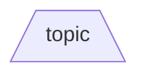
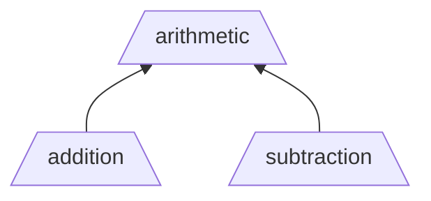
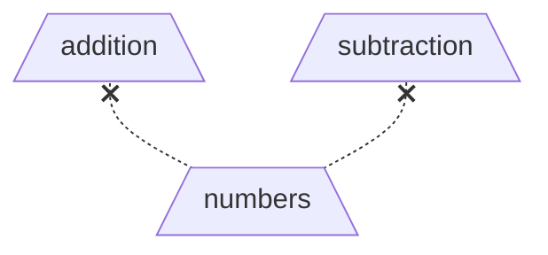
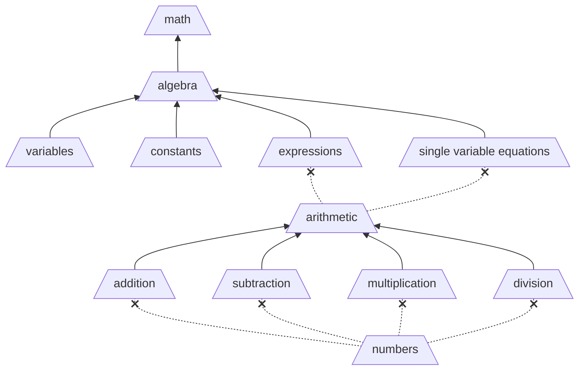

# Topic

A **Topic** is a defined unique area of knowledge and combined together to form a [topic list](topic-list.md).

- Topics are the fundamental building blocks for defining relationships between different units of knowledge.
- A topic should be as specific as possible to avoid overlapping knowledge domains. (i.e. specific, clear, unambiguous).
- All topics have the same significance. There is no predetermined hierarchy.
- A topic is referred to differently depending on its relationship to another other topic.

## Types of Topics

An **Atomic Topic** is a topic that is self-declared as a smallest knowledge domain.

- **Good Examples**: `addition`, `subtraction`
- **Bad Examples** `math`, `arithmetic`



A **Group Topic** is a topic with defined subtopics.

- Each subtopic **directly** represent proficiency in a subspace of the group topic.
- Full proficiency in all subtopics indicates full proficiency in the group topic.
- Grouping topics provides an abstraction mechanism for organic growth of the knowledge domains without exhaustive early definitions, both higher (more general) and lower (more specific).



A **Subtopic** is a topic representing proficiency in a subspace of a **single** group topic.

- Topics **DO NOT** share subtopics.

A **Pretopic**, is a topic referenced as a prerequisite in order to **begin** building proficiency in the current topic.

- Proficiency in a pretopic does **NOT** indicate proficiency in the topic requiring it.
- Any topic can be a pretopic.
- A topic may be used as a pretopic by multiple other topics.



## Extended Information

The following are additional fields that are often provided alongside a topic to provide guidance in common situations.

### Description

A single name is unlikely to explain the knowledge space covered by that topic.

As such, each topic provides a description field to provider further explanation.

```yaml
addition:
  description: Combining 2 individuals values together
```

### Documentation Reference

Each topic may provide a URL to a resource with more details about that topic.

```yaml
addition:
  docs_url: https://example.com/docs/addition
```

### Validity Period

Some topics are more stable and others are rapidly evolving or even being replaced.

As such, each topic provides a **suggested** score validity period, measured in days, for use when issuing [transcript entries](transcript-entry.md).

The below example suggests setting the expiration date at 10 years from the date it is issued.

```yaml
addition:
  validity-period: 3660 # 10 years
```

## Tips

- Use abstraction to clarify seemingly overlapping domains (i.e. same words but different context)

- A Group's dependencies should ideally be at a similar abstraction "layer of knowledge". This avoids a group topic with a very large number of subtopics.

- Group topics enable the knowledge space to expand. For example:
  - Grow Higher - Create a new topic by combining existing subtopics. This defines higher-order ability.
  - Refactor - Replace a set of subtopics with a new group topic defined by the same subtopics.
  - Go Deeper - Create new topics then add them to an existing atomic topic, converting it into a group topic.

## Detailed Example

Below is a simple example mapping the increasing proficiency from simple numbers to basic math proficiency.

> [!NOTE]
> The below is for illustration only. It is **_NOT_** intended to be an accurate representation.



<details>

<summary> Show YAML</summary>

```yaml
topics:
  numbers:
    description: Understanding numeric values and representations

  addition:
    description: Combining 2 individuals values together
    pretopics:
      - numbers

  subtraction:
    description: Finding the difference between 2 values
    pretopics:
      - numbers

  multiplication:
    description: Repeated addition to produce a product
    pretopics:
      - numbers

  division:
    description: Splitting a value into equal parts
    pretopics:
      - numbers

  arithmetic:
    description: Fundamental numeric operations
    subtopics:
      - addition
      - subtraction
      - multiplication
      - division

  variables:
    description: Symbols used to represent unknown values

  constants:
    description: Fixed values that do not change

  expressions:
    description: Combinations of numbers, variables, and operators
    pretopics:
      - arithmetic

  single-variable-equations:
    description: Equations with one unknown variable
    pretopics:
      - arithmetic

  algebra:
    description: Solving and reasoning with symbolic relationships
    subtopics:
      - variables
      - constants
      - expressions
      - single-variable-equations

  math:
    description: Broad mathematical proficiency
    subtopics:
      - algebra
```

</details>

### What does this graph say?

- The `addition` topic requires understanding the `numbers` topic before beginning.
- The `arithmetic` topic is understood if `addition`, `subtraction`, `multiplication`, and `division` are understood.
- The `expressions` topic requires understanding the `arithmetic` topic before beginning.
- The `algebra` topic is 50% understood if the `variables` and `constants` topics are understood, but not the `expressions` and `single variable equations` topics.
